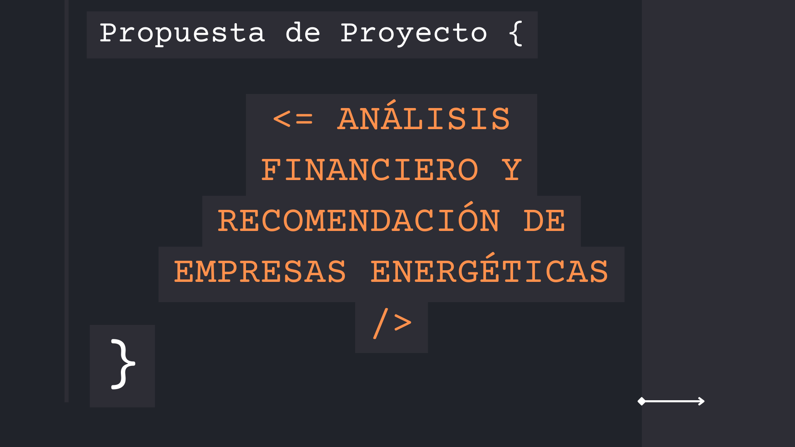
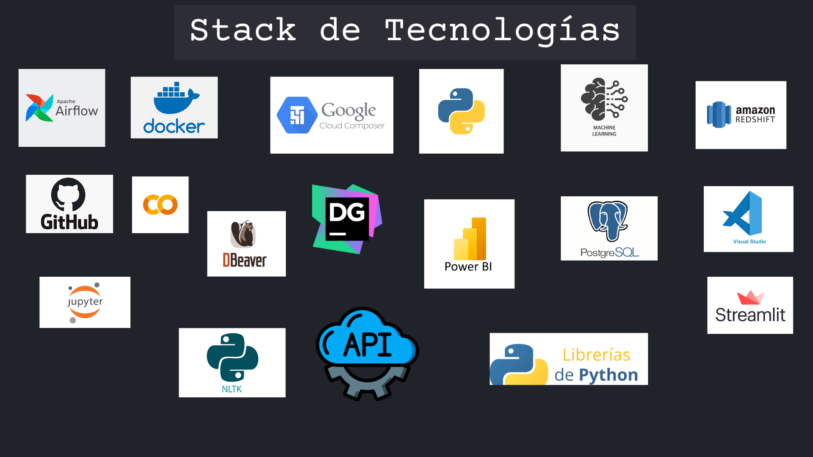
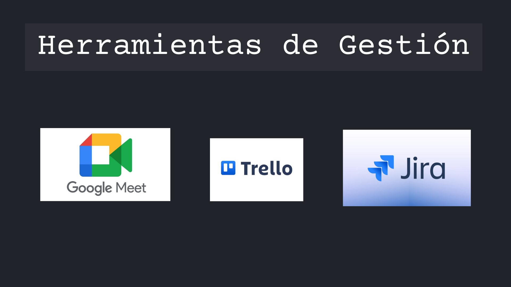
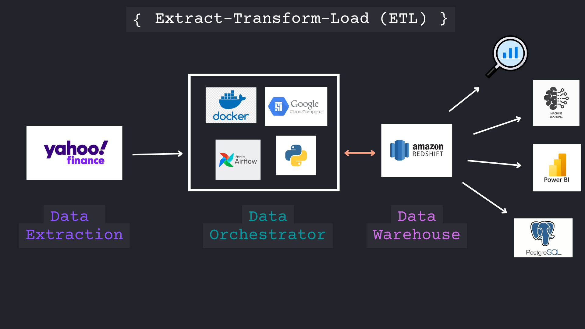

# Empresa

## Mision 🌱
En **EnergySmart Invest**, nuestro objetivo es proporcionar herramientas innovadoras y basadas en datos que permitan a los analistas e inversionistas del sector energético tomar decisiones informadas y estratégicas. Aprovechamos el poder del análisis de datos financieros, machine learning y análisis de sentimiento de noticias para ofrecer una visión integral del mercado energético, ayudando a nuestros clientes a identificar oportunidades de inversión sostenibles y rentables.

# Proyecto MVP

  

  

- **José Paternina Orozco** - Team Leader

    [Linkedin](https://www.linkedin.com/in/josepaterninaorozco/?originalSubdomain=co)

    [Gmail](mailto:juanantonio.r.m94@gmail.com)

- **Juan Cortez Zamar** - Project Manager & Data Engineer

    [Linkedin](https://www.linkedin.com/in/juanzamar)

    [Github](https://github.com/juancorzamar93)

    [Gmail](mailto:juancorzamar@gmail.com)
- **Nicolas Salamanca** - Data Scientist
  
  [Linkedin](https://www.example.com/image.jpg)

  [Github](https://github.com/NICOLAS-ANTONIO)

  [Gmail](mailto:nicolas.antonio.sm@outlook.com)

- **Juan Antonio Reyes Mendoza** - Data Scientist
 
  [Linkedin](https://www.linkedin.com/in/juan-antonio-reyes-mendoza/)

  [Github](https://github.com/JuanAntonioRe)

  [Gmail](mailto:juanantonio.r.m94@gmail.com)
  
- **Laura Minaya** - Business Intelligence Analyst
  
  [Linkedin](https://www.linkedin.com/in/laura-m-3a878b212/)

  [Gmail](mailto:lauminagui@gmail.com)

## Objetivo del proyecto
### Este proyecto tiene como objetivo proporcionar una solución integral para los analistas e inversionistas especializados en el sector energético, facilitando el acceso a datos actualizados de cotizaciones diarias de empresas que cotizan en bolsas internacionales. Mediante la integración de tecnologías avanzadas, se automatiza la extracción, almacenamiento y análisis de estos datos.

  

|  Librería/herramienta    |   Logo                                    | Descripción                                                                                                           |
|----------------------|-----------------------------------------|----------------------------------------------|
| **Pandas**   |         | Librería de Python para manipulación y análisis de datos.       |
| **NumPy**     |                        | Librería fundamental para computación numérica en Python.       | 
|**Matplotlib**|| Librería fundamental para la generación de gráficos en dos dimensiones.|
|**Yfinance**|| API de Python para datos financieros de Yahoo Finance.|
|**XGBoost**|| Librería de Python para algoritmos de boosting.|
|**Lightgbm**|| Framework de aprendizaje automático basado en árboles.|
|**Statsmodels**|| Librería de Python para modelado estadístico.|
|**Scikit-learn**|| Librería de Python para aprendizaje automático.|
| **Jupyter**|| Software gratuito, estándares abiertos y servicios web para informática interactiva en todos los lenguajes de programación.|
| **Visual Studio Code**|| Editor de código fuente.|
| **PostgreSQL**|| Herramienta visual de diseño de bases de datos que integra desarrollo de software, administración de bases de datos, diseño de bases de datos, gestión y mantenimiento para el sistema de base de datos MySQL.|
| **Colaboratory con Python**|| Utilizaremos Colaboratory, una plataforma de Google basada en Jupyter Notebooks, junto con las potentes librerías de Python para análisis de datos como Pandas, NumPy y Matplotlib.|
| **Power BI**|| Para la visualización de datos avanzada, aprovecharemos Power BI, una herramienta líder en el mercado para crear informes interactivos y paneles de control.|
| **Canva**|| Es una plataforma de diseño gráfico y composición de imágenes.|
| **Power Point**|| Microsoft PowerPoint (PPT) es un software de ofimática diseñado para realizar presentación de diapositivas..|
| **Python**|| Lenguaje de programación utilizado para análisis de datos y desarrollo de aplicaciones.|
| **GitHub**|| Plataforma de desarrollo colaborativo para proyectos de software.|
| **Trello**|| Herramienta de gestión de proyectos y seguimiento de problemas.|
| Apache Airflow |  | Plataforma de código abierto para la gestión de flujos de trabajo de datos y automatización de procesos ETL. |
| Docker |  | Plataforma de contenedores que permite crear, desplegar y gestionar aplicaciones en entornos aislados y portables. | 
| Google Composer |  | Servicio de Google Cloud que gestiona Apache Airflow, facilitando la creación y ejecución de flujos de trabajo en la nube. | 
| Amazon Redshift |  | Data warehouse escalable basado en la nube, optimizado para el análisis de grandes volúmenes de datos. | 
| PostgreSQL |  | Sistema de gestión de bases de datos relacional y de código abierto que permite almacenar y gestionar datos de manera eficiente. | 
| DBeaver |  | Herramienta de administración de bases de datos que soporta múltiples bases, incluida PostgreSQL. | 
| DataGrip |  | IDE de bases de datos de JetBrains que proporciona una interfaz avanzada para trabajar con SQL y múltiples sistemas de bases de datos. | 
| NLTK (Python) |  | Librería de Python para el procesamiento y análisis de lenguaje natural, utilizada para tareas de análisis de texto y sentimientos. |

  

### Metodología de Gestión de Proyectos

- Para gestionar este proyecto, adoptamos la metodología Scrum, una opción ideal para proyectos en entornos complejos y dinámicos que requieren agilidad y resultados rápidos. Scrum se basa en entregas parciales y regulares del producto final, priorizando el valor entregado a los clientes. Esto nos permitió trabajar de manera ágil y adaptarnos continuamente a las necesidades cambiantes del proyecto.
  
- Para la gestión, organizamos las fases del proyecto en cuatro sprints semanales. 
  
- Como herramienta de gestión inicialmente utilizamos Trello, luego migramos a Jira para un seguimiento más detallado de las tareas/sprint y google Meet para las daily meeting.

## Descripción del Proyecto

### Nuestro sistema se encarga de extraer diariamente datos financieros actualizados de empresas energéticas desde Yahoo Finance, procesarlos mediante un pipeline automatizado de ETL, y almacenarlos en un data warehouse en Amazon Redshift. A partir de estos datos, se realizan análisis exploratorios (EDA), predicciones con modelos de machine learning y visualizaciones interactivas, con el fin de generar recomendaciones de inversión para nuestros usuarios.

### Además, nuestro sistema realiza una extracción de noticias a través de la API de News API para llevar a cabo un análisis de sentimiento de las noticias relacionadas con las empresas energéticas, permitiendo identificar el impacto de las noticias negativas en los precios de las acciones.

### Problema 🧠

Los analistas e inversionistas en el sector energético enfrentan dificultades para obtener datos financieros actualizados y confiables sobre las empresas energéticas que cotizan en bolsas internacionales. Esta falta de datos actualizados puede dificultar la toma de decisiones informadas sobre inversiones y estrategias de mercado.

### Solución 💡

La solución planteada consiste en un sistema automatizado que:

- 🔄 Extrae datos financieros diariamente desde [Yahoo Finance](https://finance.yahoo.com "Yahoo Finance")  utilizando técnicas de web scraping.
- 📊 Almacena los datos en un data warehouse en Amazon Redshift, permitiendo acceso rápido y centralizado a información actualizada.
- 🚀 Genera visualizaciones interactivas con Power BI, que muestran las cotizaciones históricas y actuales de las empresas energéticas.
- 🤖 Implementa modelos de machine learning para predecir el comportamiento futuro de las acciones, ayudando a los analistas a tomar decisiones informadas.
- 📰 Realiza análisis de sentimiento de noticias utilizando la API de News API, clasificando el sentimiento negativo sobre las empresas energéticas.
  
Este sistema proporciona a los analistas e inversionistas la capacidad de obtener datos confiables y actualizados de forma automatizada, lo que facilita la toma de decisiones estratégicas en el sector energético.

  

### Características Principales 💡

- Extracción de datos financieros mediante web scraping.

- Automatización de procesos ETL usando Airflow en Composer de Google.

- Análisis exploratorio de datos (EDA) para obtener insights iniciales.

- Análisis avanzado de datos financieros.

- Análisis de sentimientos de noticias relacionadas con empresas de energía de América Latina
  
- Visualización interactiva de los datos financieros históricos y actuales mediante Power BI.

- Despliegue del modelo de machine learning para predicción de comportamientos futuros en las bolsas internacionales.

### Datos Financieros

Los datos extraídos de Yahoo Finance para cada empresa energética incluyen las siguientes columnas:

- **Date:** Fecha de la transacción. Representa el día en que los datos financieros fueron registrados para esa empresa energética.

- **Open:** Precio de apertura. Es el precio al que se negoció la primera acción del día de la empresa en el mercado. Este valor puede dar una indicación de cómo comenzaron las negociaciones ese día.

- **High:** Precio más alto del día. Es el precio más alto al que se negoció la acción de la empresa durante el día. Este dato es clave para ver la volatilidad de los precios.

- **Low:** Precio más bajo del día. Es el precio más bajo al que se negoció la acción de la empresa durante el día. Complementa al valor de High para entender la amplitud de variaciones.

- **Close:** Precio de cierre. Es el precio al que se negoció la última acción del día. Este valor se utiliza frecuentemente para hacer análisis de tendencias y comparar el rendimiento de una acción en días consecutivos.

- **Volume:** Volumen de transacciones. Representa el número total de acciones de la empresa que fueron negociadas durante ese día. Un volumen alto puede indicar un interés creciente en la empresa, mientras que un volumen bajo podría reflejar lo contrario.

- **Dividends:** Dividendos pagados. Si la empresa distribuye dividendos a sus accionistas en una fecha determinada, este valor reflejará cuánto se ha pagado por acción. Si no hubo dividendos, el valor será cero o estará vacío.

- **Stock Split:** Desdoblamiento de acciones. Cuando una empresa realiza un split de sus acciones (por ejemplo, 2 por 1), se indica en esta columna. Un "split" significa que las acciones se dividen, lo cual no cambia el valor total de la inversión, pero ajusta el precio por acción.

### Etapas del Proyecto 🚀  
- **Mockup Técnico:** Diseño inicial y planteamiento técnico del sistema de extracción, almacenamiento y visualización de los datos financieros.
- **Mockup Sentimiento:** Implementación de la funcionalidad para analizar el sentimiento de las noticias de las empresas energéticas de América Latina.
- **Mockup Predictivo:** Desarrollo del modelo de machine learning para predecir el comportamiento de las acciones basado en los datos históricos y actuales.
- 
### Contenidos del Proyecto
- 📊 **Dashboard :** Visualización interactiva de los datos financieros en Power BI. Enlace al tablero (aquí incluirás el link y la imagen del dashboard).
- 📂**Data :** Acceso al dataset utilizado para el análisis financiero. Enlace al dataset.
- 📑**Presentación:** Presentación del proyecto en PowerPoint. Enlace a la presentación.

## 📢 Conclusiones clave

